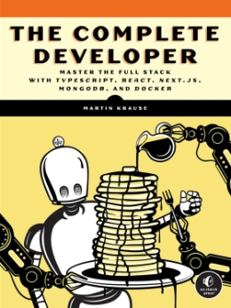

  <b>A tutorial in my <a href="https://github.com/abeerration/CS-Self-Education">CS Self Education</a> series</b>
  <h1>Full Stack Development with TypeScript, React, Next.js & MongoDB</h1>
  
  
  
  

---

## Prerequisites

None

## Description & Goals

This tutorial is about learning full stack JavaScript development with TypeScript, React, Next.js & MongoDB.

---

## Materials

| # | Cover | Title |
| ----------- | ----------- | ----------- |
| **1.** |  | <h4><i>Martin Krause</i></h4><h2>The Complete Developer</h2><i>Master the Full Stack with TypeScript, React, Next.js, MongoDB, and Docker</i><h4>No Starch Press</h4>
2024

<i>Book</i>
 |

---

## Course Work

| # | Activity | Date / Duration | Links |
| ----------- | ----------- | ----------- | ----------- |
| **1.** | **Chapter 1** – Node.js | 08 Mar 2024 | [code]() / [demo]() |
| **2.** | **Chapter 2** – Modern JavaScript | - | [code]() / [demo]() |
| **3.** | **Chapter 3** – TypeScript | - | [code]() / [demo]() |
| **4.** | **Chapter 4** – React | - | [code]() / [demo]() |
| **5.** | **Chapter 5** – Next.js | - | [code]() / [demo]() |
| **6.** | **Chapter 6** – REST and GraphQL APIs | - | [code]() / [demo]() |
| **7.** | **Chapter 7** – MongoDB and Mongoose | - | [code]() / [demo]() |
| **8.** | **Chapter 8** – Testing with the Jest Framework | - | [code]() / [demo]() |
| **9.** | **Chapter 9** – Authorization with OAuth | - | [code]() / [demo]() |
| **10.** | **Chapter 10** – Containerization with Docker | - | [code]() / [demo]() |
| **11.** | **Chapter 11** – Setting Up the Docker Environment | - | [code]() / [demo]() |
| **12.** | **Chapter 12** – Building the Middleware | - | [code]() / [demo]() |
| **13.** | **Chapter 13** – Building the GraphQL API | - | [code]() / [demo]() |
| **14.** | **Chapter 14** – Building the Frontend | - | [code]() / [demo]() |
| **15.** | **Chapter 15** – Adding OAuth | - | [code]() / [demo]() |
| **16.** | **Chapter 16** – Running Automated Tests in Docker | - | [code]() / [demo]() |
